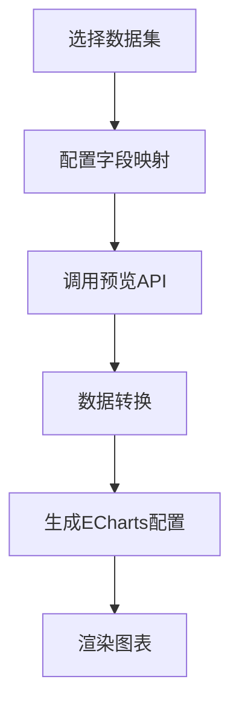

# 仪表盘数据集图表渲染功能使用说明

## 📋 功能概述

本功能实现了在仪表盘编辑器中通过 `datasetId` 动态获取数据并渲染图表的能力。支持饼图、柱状图、折线图和表格等多种图表类型。

## 🚀 核心特性

- ✅ **支持多种图表类型**: 饼图、柱状图、折线图、表格
- ✅ **智能字段映射**: 自动推荐合适的字段配置
- ✅ **实时数据获取**: 通过 API 动态获取数据集数据
- ✅ **错误处理**: 完善的错误提示和异常处理
- ✅ **类型安全**: 完整的 TypeScript 类型定义

## 📡 API 接口

### 数据集预览接口
```
GET /api/datasets/{datasetId}/preview
```

**返回数据格式:**
```json
{
    "code": 200,
    "message": "成功",
    "data": {
        "columns": ["gender", "患者ID"],
        "data": [
            ["M", 10],
            ["F", 10]
        ],
        "totalCount": 2
    }
}
```

## 🔧 技术实现

### 1. 数据转换工具 (`src/utils/chartDataTransform.ts`)

负责将 API 返回的二维数组数据转换为 ECharts 所需的格式：

```typescript
// 饼图数据转换示例
const transformForPieChart = (apiResponse, mapping) => {
  // 将 [["M", 10], ["F", 10]] 转换为
  // [{ name: "M", value: 10 }, { name: "F", value: 10 }]
}
```

### 2. 仪表盘数据服务 (`src/services/dashboardDataService.ts`)

提供统一的数据获取和图表渲染服务：

```typescript
// 获取图表数据并生成 ECharts 配置
const getChartData = async (datasetId, chartType, fieldMapping, chartConfig) => {
  // 1. 调用 API 获取数据
  // 2. 转换数据格式
  // 3. 生成 ECharts 配置
  // 4. 返回完整的图表选项
}
```

### 3. 数据集配置面板 (`src/components/dashboard/DatasetConfigPanel.vue`)

提供可视化的数据集配置界面，包括：
- 数据集选择
- 字段映射配置
- 数据预览
- 智能推荐

## 📊 图表类型配置

### 饼图 (Pie Chart)
```typescript
const fieldMapping = {
  nameField: 'gender',    // 名称字段
  valueField: '患者ID'    // 数值字段
}
```

### 柱状图/折线图 (Bar/Line Chart)
```typescript
const fieldMapping = {
  xField: 'gender',       // X轴字段
  yField: '患者ID'        // Y轴字段
}
```

### 表格 (Table)
```typescript
const fieldMapping = {
  tableFields: ['gender', '患者ID']  // 显示字段
}
```

## 🎯 使用示例

### 1. 在仪表盘编辑器中使用

```vue
<template>
  <!-- 数据集配置面板 -->
  <DatasetConfigPanel
    :chart-type="selectedChart.type"
    :initial-config="{
      datasetId: selectedChart.datasetId,
      fieldMapping: selectedChart.fieldMapping
    }"
    @config-change="handleDatasetConfigChange"
  />
</template>

<script setup>
// 处理数据集配置变更
const handleDatasetConfigChange = async (config) => {
  selectedChart.value.datasetId = config.datasetId
  selectedChart.value.fieldMapping = config.fieldMapping
  
  if (config.isValid) {
    await initChartInstance(selectedChart.value.i, selectedChart.value)
  }
}
</script>
```

### 2. 图表初始化

```typescript
const initChartInstance = async (chartId: string, config: ChartConfig) => {
  // 如果配置了数据集ID，使用数据集数据渲染
  if (config.datasetId && config.fieldMapping) {
    const echartsOption = await getChartData(
      config.datasetId,
      config.type,
      config.fieldMapping,
      config
    )
    chart.setOption(echartsOption)
  }
}
```

## 🎨 演示页面

访问 `/dataset-chart-demo` 查看完整的演示，包括：
- 数据集ID输入
- 图表类型选择
- 字段映射配置
- 实时图表渲染
- 数据预览

## 📁 文件结构

```
src/
├── api/
│   └── dataset.ts                 # 数据集API
├── components/
│   └── dashboard/
│       └── DatasetConfigPanel.vue # 数据集配置面板
├── services/
│   └── dashboardDataService.ts   # 仪表盘数据服务
├── utils/
│   └── chartDataTransform.ts     # 数据转换工具
├── types/
│   └── dashboard.ts              # 类型定义
└── views/
    ├── DashboardDesigner.vue     # 仪表盘设计器
    └── DatasetChartDemo.vue      # 演示页面
```

## 🔗 数据流程



## ⚡ 性能优化

1. **数据缓存**: 避免重复请求相同数据集
2. **智能推荐**: 根据字段名自动匹配合适的映射
3. **错误处理**: 完善的异常处理和用户提示
4. **类型安全**: TypeScript 确保代码质量

## 🎯 使用建议

1. **数据集设计**: 
   - 维度字段用于分类（如：科室、性别、类型）
   - 度量字段用于计算（如：数量、金额、比率）

2. **字段命名**:
   - 使用有意义的中文名称
   - 包含关键词便于智能推荐（如：count、amount、name）

3. **图表选择**:
   - 饼图：适合展示部分与整体关系
   - 柱状图：适合对比不同类别数值
   - 折线图：适合展示趋势变化
   - 表格：适合展示详细数据

这套完整的解决方案为您的仪表盘系统提供了强大的数据集集成能力，让图表配置变得简单高效！ 