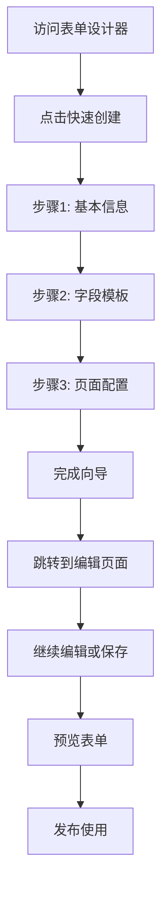

# 🚀 快速表单生成向导 - 启动指南

## ✅ 已集成的组件

### 1. 核心向导组件
- **QuickFormWizard.vue** - 主向导组件（三步流程）
- **FormDesigner/index.vue** - 表单设计器主页面（已集成向导）
- **FormDesigner/edit.vue** - 表单编辑页面（支持向导数据）
- **FormDesigner/preview.vue** - 表单预览页面

### 2. 类型定义和示例
- **form-wizard.ts** - 完整的TypeScript类型定义
- **basic-usage.vue** - 使用示例和医疗行业模板

## 🎯 如何访问快速向导

### 方式一：主页面快速入口（推荐）
1. 启动项目：`npm run dev`
2. 访问：`http://localhost:5173`
3. 点击导航栏的 **"表单设计器"**
4. 在页面右上角点击 **"快速创建表单"** 按钮

### 方式二：快速入口卡片
- 如果是新用户（没有现有表单），页面会显示快速入口卡片
- 直接点击 **"快速创建向导"** 卡片启动

### 方式三：查看完整示例
- 点击导航栏 **"更多"** → **"快速向导示例"**
- 体验完整功能和医疗行业预设模板

## 📋 三步向导流程

### 步骤一：基本信息配置
- ✅ 表单名称（必填）
- ✅ 表单说明（可选）
- ✅ 数据源选择（模拟接口）
- ✅ 数据表选择（模拟接口）

### 步骤二：字段模板选择
- ✅ **个人信息模板**：姓名、性别、出生日期、手机号等
- ✅ **商品信息模板**：商品名、单价、库存、分类等
- ✅ **医疗登记模板**：患者信息、科室、医保类型等
- ✅ **空模板**：从零开始设计
- ✅ 支持字段预览和后续修改

### 步骤三：页面生成配置
- ✅ 自动生成菜单（默认勾选）
- ✅ 菜单挂载位置选择
- ✅ 自动生成路由路径（可编辑）
- ✅ 智能路径建议

## 🔧 核心功能特性

### 智能化功能
- **自动路径生成**：根据表单名称智能生成路由
- **模板预设**：内置常用业务场景模板
- **字段预览**：实时预览字段效果
- **医疗行业优化**：专门的医疗场景预设

### 用户体验
- **步骤式引导**：降低学习成本
- **一键完成**：3步完成表单创建
- **无缝衔接**：向导完成后直接进入编辑模式
- **数据保持**：向导配置自动传递到编辑器

## 🏥 医疗行业预设模板

### 患者登记表
```javascript
{
  name: '患者登记表',
  fields: [
    { name: 'patient_name', label: '患者姓名', type: 'input', required: true },
    { name: 'id_card', label: '身份证号', type: 'input', required: true },
    { name: 'gender', label: '性别', type: 'radio', options: ['男', '女'] },
    { name: 'birthday', label: '出生日期', type: 'date', required: true },
    { name: 'phone', label: '联系电话', type: 'input', required: true },
    { name: 'medical_insurance', label: '医保类型', type: 'select', 
      options: ['城镇职工', '城乡居民', '新农合', '自费'] },
    { name: 'department', label: '科室', type: 'select', required: true }
  ]
}
```

### 药品信息表
```javascript
{
  name: '药品信息表',
  fields: [
    { name: 'drug_name', label: '药品名称', type: 'input', required: true },
    { name: 'drug_code', label: '药品编码', type: 'input', required: true },
    { name: 'specification', label: '规格', type: 'input' },
    { name: 'manufacturer', label: '生产厂家', type: 'input' },
    { name: 'price', label: '单价', type: 'number', required: true },
    { name: 'stock', label: '库存数量', type: 'number' },
    { name: 'expiry_date', label: '有效期', type: 'date' }
  ]
}
```

## 🎨 页面集成详情

### 表单设计器主页面结构
```vue
<template>
  <div class="form-designer">
    <!-- 页面头部 -->
    <div class="page-header">
      <el-button type="primary" @click="showWizard = true">
        快速创建表单
      </el-button>
    </div>

    <!-- 快速入口卡片（新用户） -->
    <div class="quick-start-section" v-if="!hasExistingForms">
      <el-card @click="showWizard = true">
        <h3>快速创建向导</h3>
        <p>3步完成表单创建</p>
      </el-card>
    </div>

    <!-- 向导组件 -->
    <QuickFormWizard
      v-model="showWizard"
      @done="handleWizardDone"
    />
  </div>
</template>
```

### 向导完成后的流程
1. 向导完成后触发 `@done` 事件
2. 自动跳转到表单编辑页面
3. 向导配置数据通过路由参数传递
4. 编辑页面自动加载向导配置的字段

## 🔄 完整工作流程



## 🚀 快速开始

### 1. 启动项目
```bash
npm run dev
```

### 2. 访问表单设计器
- 打开浏览器访问：`http://localhost:5173`
- 点击导航栏的 **"表单设计器"**

### 3. 使用快速向导
- 点击 **"快速创建表单"** 按钮
- 按照三步向导完成配置
- 享受快速表单创建体验！

## 📝 注意事项

1. **API接口**：当前使用模拟数据，实际使用时需要配置真实的后端接口
2. **数据持久化**：表单数据目前存储在前端，需要集成后端存储
3. **权限控制**：可根据需要添加用户权限和访问控制
4. **自定义扩展**：支持添加自定义字段类型和模板

## 🎉 恭喜！

您现在已经成功集成了快速表单生成向导！这个向导将大大提升您的表单创建效率，特别适合医疗行业的快速业务搭建需求。

如有任何问题，请参考 `README.md` 文档或查看示例代码。 